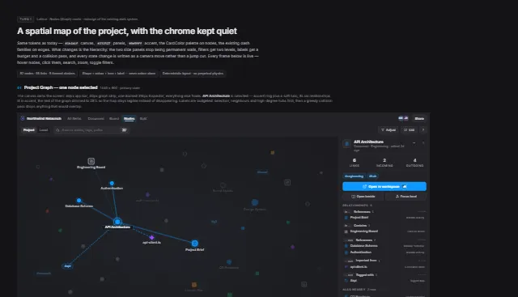

# Lattice Graph v3 — UI prototype



The interactive prototype that specified **19B — Graph upgrades**
([#93](https://github.com/FraOri03/Lattice/issues/93)).

Committed for the same reason as the others: a prototype nobody can find is a
prototype nobody can check.

## Run it

Any static server works — the pages load `support.js` from the same directory,
so `file://` will not do.

```bash
python -m http.server 8899 --directory docs/prototypes/graph-v3
```

`Lattice Nodes.dc.html` is the annotated index; `LatticeGraphFrame.dc.html` is
the live frame.

## What it specified, and what was built

The work is in review in [#251](https://github.com/FraOri03/Lattice/pull/251);
it is not on `main` at the time this prototype was committed.

| Frame | What it drew | Built |
| --- | --- | --- |
| **01** | Canvas owning the screen, one docked inspector, selection with a halo and the rest dimmed to 28% | yes |
| **A** | Hover highlighting: the node grows, the tooltip travels with it | node growth and dimming yes; the tooltip is still a screen-space card |
| **B** | Search: matches ringed, the matched substring shown, a `type · cluster` subtitle, the camera flying rather than teleporting | yes |
| **C** | Local graph as one 30px bar — the way back, the root, a depth stepper, how much is in view — with the second hop grouped under its branch | yes |
| **D** | Adjust as a 306px popover that never takes canvas width, on two tiers, relationship rows showing their real dash | yes |
| **E** | Below 1440px the inspector undocks into a floating drawer | yes |
| **F** | Filtered-empty explains itself and offers the way back | already existed |

The hover tooltip is the one frame-A detail left undone: it is still a
screen-space card near the cursor, so it does not travel with the node while
the camera moves.

Two things the prototype does not draw, added because they live in the same
files: **edges became selectable** (with a panel that says why a relationship
exists), and **pins became releasable**.

## Where it differs from what shipped

- **The mode is still called Graph, not "Nodes".** `viewMode` is persisted and
  serialised into URLs, Phase 9.5 already declined the same rename for
  Document, and a *relationship* browser named after nodes is titled to its
  least interesting primitive. The prototype's label is the part that is wrong.
  Note the Present prototype draws the same tab as "Graph".

## Provenance

`github.md` records the sync and which source files each screen was built from
— the tokens, the CardColor palette, the edge dash families and the real
iconography, so the prototype is a redesign of the existing system rather than
a new one.
