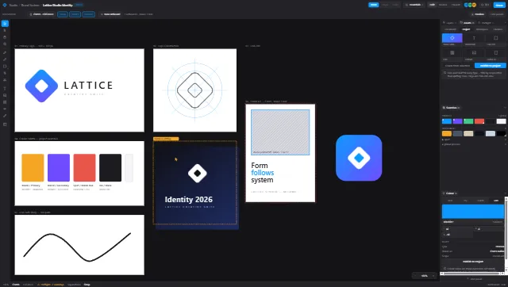

# Trace — UI prototype



A high-fidelity, interactive UI prototype of **Trace**, the vector environment of the
Lattice Creative Suite (phase 23, epic [#206](https://github.com/FraOri03/Lattice/issues/206)).

It lived outside the repository until now. It is committed here because it is the most
developed artefact that exists for Trace, and because a prototype nobody can find is a
prototype nobody can check.

## Run it

Any static server works — the pages load `support.js` from the same directory, so
`file://` will not do.

```bash
python -m http.server 8899 --directory docs/prototypes/trace
```

Then open `http://127.0.0.1:8899/Lattice%20Trace.dc.html`.

## Files

| File | What it is |
|---|---|
| `Lattice Trace.dc.html` | **v2, current.** The full Trace shell: mode switcher, tool rail, context bar, dockable/floating panel system, workspace presets, canvas, status bar. |
| `Lattice Vector Mode.dc.html` | v1. Same environment under its pre-naming title ("Vector / Raster / Editorial"). Kept for the design history — see the icon note below. |
| `CreativePanel.dc.html` | The panel content renderer, extracted as its own component. |
| `support.js` | Vendored runtime for the `.dc.html` format. Generated — do not edit. |
| `github.md` | The design tool's sync record: which Lattice source file each screen was built from. |
| `preview.webp` / `.thumbnail` | The same image. `.thumbnail` is the tool's own file and is kept so its round-trip is not broken; `preview.webp` is the viewable copy. |

The zip this came from also contained a copy of `src/styles/index.css`. It is byte-identical
to the repository's own file (modulo line endings) and is deliberately **not** committed
here — the prototype is not the owner of Lattice's design tokens.

## What is real

Genuinely implemented and worth reviewing as a specification:

- **Panel system** — dock left/right, float, tab-group, reorder, resize, collapse, close,
  reopen, with live drop zones during a drag.
- **Workspaces** — six discipline presets (Essentials, Branding, Illustration, Typography,
  Print & Prepress, UI/Icon Design), save-as, dirty indicator, reset. Persisted to
  `localStorage` under `lattice.trace.workspace`.
- **Panel taxonomy** — every panel is tagged `core` (shared by the whole Creative Suite) or
  `trace` (mode-specific). That is the phase 22.5 shared/specialised matrix, expressed in
  data rather than in prose.
- **Context bar** — the bar above the canvas changes with both the active tool and the
  selected object type: node mode offers Join/Average/Break/Reverse/Simplify/Smooth, a live
  shape offers per-corner radii, text offers the type controls.
- **Contextual Properties** — the inspector's sections follow the selected object's type,
  which is what keeps the panel count low.
- **Tool rail** — 14 tools with long-press groups, shortcut map, and per-tool cursors.
- **Selection, node selection, pan/zoom, layer tree, snapping options.**
- **Interop surfaces** — "Source updated" toast with Update/Compare/Ignore, Links panel with
  staleness, Find usages, Open in Graph, project swatches, a type style "Shared with Folio,
  Presentations, Documents", presence and an object-anchored comment.

Two architectural positions are stated in the source and are worth keeping:

- Workspace and panel state is **Creative Core UI state**, deliberately outside the document
  model and outside document undo.
- Geometry lives keyed by **object id**, ready for CRDT and object-anchored comments.
- History entries are **semantic transactions, not raw mutations** — one drag is one entry —
  and undo rolls back only your own actions.

## What is simulated

The prototype says so itself, on screen, which is the right way to do it:

- ICC conversion and on-screen colour ("a CSS approximation, no ICC transform is applied")
- Preflight checks, ink coverage and total area coverage
- Plate separations
- PDF/X-4 export ("no file is produced and no compliance is claimed")

## What is empty

**This is the part to read before estimating anything.** The prototype contains 104
no-op handlers. Among the named ones:

> Join · Average · Break · Reverse · Simplify · Smooth · Offset Path… · Outline Stroke ·
> Tidy · Group · Mask · Compound

Those buttons are the whole of subphase 23.3 (pen and Bézier editing) and the whole of 23.4
(shapes, booleans, compound paths). Also absent:

- **No geometry engine.** The canvas is SVG/DOM over nine hard-coded objects. Subphase 23.1
  requires a GPU-backed renderer because SVG/DOM does not reach the phase-22.7 targets — the
  prototype does not contradict that, it simply does not address it.
- **No Bézier maths.** The path study is four hand-written nodes in an array; adding,
  deleting and converting a node edits that array.
- **No boolean operations.** `boolOp(op)` records which button was pressed.
- **No undo.** There is a note describing how undo should behave, and no undo.
- **No persistence of documents.** Only the workspace layout is persisted.

## How to read this against the roadmap

On the ladder in [docs/architecture/creative-suite.md](../../architecture/creative-suite.md):

| State | Trace |
|---|---|
| **Mocked UI** | Substantially done, and done well. This prototype is it. |
| **Functional implementation** | Not started. |
| **Production implementation** | Not started. |

The prototype is best treated as a **deliverable of phase 22.2** (the creative shell) and as
a UX specification for phase 23 — not as evidence that phase 23 is partly built. It looks
finished enough that it invites exactly that mistake, which is why this file lists the empty
handlers by name.

## Known divergences to resolve

1. **Flux is missing.** The switcher offers Trace, Forge and Folio. The suite has four
   environments ([#98](https://github.com/FraOri03/Lattice/issues/98), phase 26). Either the
   prototype predates the fourth or Flux was reconsidered — that needs an answer.
2. **The Selection icon drifted.** v1 reused `IcCursor` from `src/components/Icons.tsx`
   verbatim (`m3 3 7.1 17 2.5-7.4L20 10.1z`); v2 redrew it
   (`M6 3l13 10-5.5.8L16 20l-2.6 1-2.7-6L6.8 19z`). Same environment, same author, two
   iterations apart. This is the strongest available argument for the canonical icon registry
   in [#139](https://github.com/FraOri03/Lattice/issues/139).
3. **Workspace persistence is global**, under one `localStorage` key. Issue
   [#98](https://github.com/FraOri03/Lattice/issues/98) requires the active mode and its
   layout to live in the **project** tab session, so two projects can be left in different
   states.
4. **The way back is unspecified.** In Trace the creative cluster replaces the section
   cluster, so Board, Graph, Document, Sheet, Presentation, Code and Photo are not on screen.
   The breadcrumb is the presumed exit; it needs to be settled explicitly.
